# 🚀 Real-Time Collaborative Code Editor

A Google Docs–style collaborative code editor built with **React + Monaco Editor**, **WebSockets**, and **MongoDB**.  
Supports real-time cursor tracking, batched updates, and efficient compaction of operational logs.

---

## ✨ Features

- 🖊️ **Live Code Editing** – Multiple users can edit the same file simultaneously.
- 👥 **Remote Cursor Tracking** – See collaborators' cursors and names in real-time.
- ⚡ **Low-Latency Updates** –  
  - Cursor positions are emitted instantly.  
  - Text updates are sent per keystroke for responsiveness.  
  - Backend updates are **batched** for efficiency.  
- 📦 **Operational Log Storage (CRDT-inspired)** – Every edit is stored as a payload with position and timestamp.
- 🧹 **Automatic Compaction** –  
  - Old operations are periodically merged into snapshots.  
  - Keeps database size manageable and lookup efficient.
- 🔄 **Diff/Patch Algorithm** – Efficiently applies incoming changes with near O(1) updates.

---

## ⚙️ Tech Stack

- **Frontend:** React, Monaco Editor, TailwindCSS  
- **Backend:** Node.js, Express.js, WebSocket  
- **Database:** MongoDB (Ops log + snapshots)  

---

## 🏗️ How It Works

1. **Payload Generation**  
   - Each edit generates a payload:  
     ```json
     {
       "startIndx": 0,
       "endIndx": 0,
       "newLines": ["e"],
       "startColumn": 0,
       "endColumn": 0,
       "deleteCount": 1,
       "timeStamp": 1694567890000
     }
     ```

2. **Frontend → Backend**  
   - Cursor updates: sent instantly.  
   - Text updates: emitted live but **batched before DB writes**.

3. **Backend Storage**  
   - Stores operations like a CRDT log.  
   - Runs **compaction every 10 minutes** or when a file is opened.
   - Operations update in DB takes O(1) in general.

4. **Diff/Patch Algorithm**  
   - Applies ops in timestamp order.  
   - Achieves **O(1)** for most updates, **O(n)** worst case during compaction.

---

## 📊 Efficiency

- **Cursor emission latency:** ~30–80 ms  
- **Text update latency:** ~100–200 ms  
- **DB writes:** Batching reduces ops from 1000s → 10s  
- **Compaction complexity:** amortized ~O(1)–O(n), runs in background
- This project implements a custom text buffer inspired by ropes and CRDTs, using a LinkedList + Map hybrid for O(1) line access and update.
- Keystroke operations are batched (coalesced) into larger diffs to reduce overhead.

---

## 🚧 Future Improvements

- 🔐 Access control (roles: leader, member).  
- 📝 Syntax highlighting with Monaco’s language services.  
- 🌍 Support for cross-region low-latency replication.  

## 🔄 System Flow


## Diff Match Patch Flow

```mermaid
sequenceDiagram
  participant U as User (Monaco)
  participant D as Diff Engine
  participant RT as Real-time Server
  participant DB as Ops Store
  participant P as Peers

  U->>D: Local edit (range, text)
  D->>D: Compute minimal diff (start,end,newText)
  D-->>RT: Patch payload
  RT->>DB: Append op (O(1))
  RT-->>P: Broadcast patch
  P->>P: Apply patch → update editor
```

## Compaction Flow

## Edit and Broadcast

## Operation Coalescing

```mermaid
flowchart TD

    subgraph YourAlgo["Hybrid Approach (LinkedMapBuffer)"]
        C1["LinkedList → Maintains line order (O(1) insert/delete)"]
        C2["HashMap → Direct access by lineId (O(1))"]
        C3["Ops Batching → Merge keystrokes into single op"]
        C4["Diff-Patch → Store transformations instead of whole text"]
        C1 --> C2
        C2 --> C3
        C3 --> C4
    end
```


When working on real-time editors, every keystroke usually triggers a payload that’s sent to the backend.  
This can quickly flood the network with redundant updates — especially when a user types fast or deletes characters continuously.  

To tackle this, I implemented an **operation coalescing algorithm** that intelligently merges multiple nearby operations into a single optimized payload before synchronization.

---

### 🧩 How It Works

- Each edit (insert or delete) is captured as an operation with metadata:
  - `startIndex`
  - `startColumn`
  - `endColumn`
  - `deleteCount`
  - `newString`
- Before sending updates, operations on the same line or in close proximity are **merged** using the `mergeOps()` function.
- Both **insertions** and **deletions** are handled gracefully to maintain data integrity and consistent cursor behavior.
- The result: fewer network calls, less load on the database, and a smoother collaborative experience.

---

### ✨ Before vs After

| Case | Without Coalescing | With Coalescing |
|------|--------------------|----------------|
| Typing 24 characters | 24 payloads sent | **4 payloads** sent |
| Reduction | — | **≈83.3% fewer payloads** 🚀 |

---

### 🧠 Example

#### Before Coalescing
```js
[
  { startColumn: 1, newString: "H" },
  { startColumn: 2, newString: "e" },
  { startColumn: 3, newString: "l" },
  { startColumn: 4, newString: "l" },
  { startColumn: 5, newString: "o" }
]

